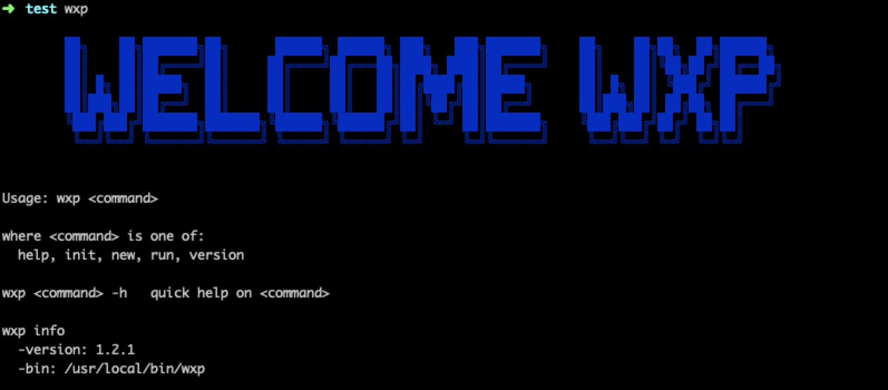

# wxapp-project
wxapp-project是一个小程序前端工程构建流的工具。

---

>目前已经支持:
>
> ✔︎ less转化为wxss
> 
> ✔︎ 支持px转化rpx（不编译px请用大写PX表示）
> 
> ✔︎ 支持打包压缩，文件内联base64转换
> 
> ✔︎ 可以配置忽略文件、某些设置的开关等
> 
> ✔︎ 增加增量编译，已编译过的文件不会再次编译
> 
> ✔︎ 自动压缩项目内png、jpg、jpeg、svg、gif文件
> 

---

> 更新预告:
> 
> ➟ 快速创建小程序模版文件
> 
> ➟ 腾讯云快速上传储存桶支持(cos对象存储)
> 
> ➟ 腾讯云内容分发网络支持(cdn)
> 
> ...

---

# 安装&使用
```
npm i -g wxapp-project
```

- 尝试在小程序根目录跑通`wxp run`

- 查看更多帮助信息请使用`wxp -h`


# 详细使用说明

- ### `wxp init`

	将会在当前目前下创建.wxp.json配置文件
	
	```
	{
		'less2wxss': true,
		'minifyImage': true,
		'px2rpx': true,
		'rpxUnit': 1,
		'inlineUrl': true,
		'minifyWxss': false,
		'ignore': [{
			'type': 'folder',
			'value': 'node_modules',
		}],
	}
	```
	
	- `less2wxss` 是否开启less转化成wxss的功能 默认为`true`
	- `minifyImages` 是否开启压缩图片的功能 默认为`true`
	- `px2rpx` 是否开启px转化成rpx 默认为`true`
	- `rpxUnit` `px`转化成`rpx`的倍数 默认为`1`
	- `inlineUrl` 是否将less中内联的文件转化成base64 默认为`true `
	- `minifyWxss` 是否开启转化打包后的wxss进行压缩 默认为`false`
	- `ignore` 忽略监听文件
	   - `type` 类型，如`folder` `file` `glob`等
	   - `value` 路径或取值，如`node_modules`
	
	其中`ignore`详细的使用方式和微信小程序`project.config.json`中的`ignore`忽略方法如出一辙，[点击此处查看](https://developers.weixin.qq.com/miniprogram/dev/devtools/projectconfig.html?search-key=ignore)。（__注意__，less的忽略只是不打包成wxss。如a.less import b.less，b.less文件被忽略，那么b.less的保存还是会监听到并且会追溯到a的更新打包，只是b.less不打包成wxss），图片的监听忽略是不压缩
	

- ### `wxp run`
	
	wxapp-project的核心，以小程序目录为根目录，运行`wxp run`命令，将会以项目运行目录为根目录进行监听编译。

- ### `wxp new`
	快速创建小程序工程（待更新）
	过后我也会放几个样例模版供大家开发。


# bug&tip
* 欢迎在issue中提出


